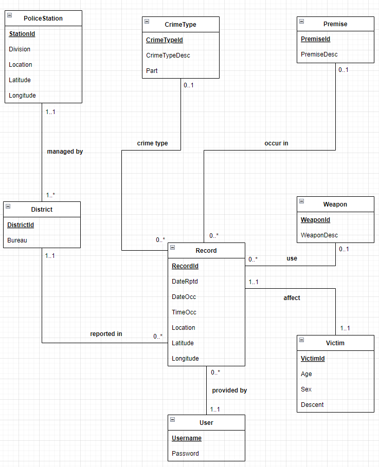

## UML Diagram

## Assumption

We assume that:

+ PoliceStation: For each PoliceStation, there is at least 1 district managed by it.
+ District: For each District, it's managed by exactly 1 PoliceStation.
+ CrimeType: The same type of Crime can happen in multiple Records.
+ Premise: The same Premise can appear in multiple Records.
+ Weapon: The same type of Weapon can be used in multiple crime Records.
+ User: Each user can provide any number of crime Records.
+ Victim: Each Victim gets involved in exactly 1 crime Records.
+ Record: For each crime Record, it includes exactly 1 District, exactly 1 Victim, at most 1 CrimeType, Premise and Weapon. It should be provided by exactly 1 user.

## Description

+ managed by: Each District is managed by exactly 1 PoliceStation, while each PoliceStation manages at least one District.
+ reported in: Each crime Record is reported to exactly 1 District, while each District may get involved in any number of Records.
+ provided by: Each crime Record is provided by exactly 1 User, while each User may provide any number of Records.
+ use: Each crime Record uses at most 1 Weapon, while each Weapon is used in any number of crime Records.
+ occur in: Each crime Record occurs in at most 1 Premise, while each Premise may get involved in any number of crime Records.
+ crime type: Each crime Record includes at most 1 CrimeType, while each CrimeType may happen in any number of crime Records.
+ affect: Each crime Record affects exactly 1 Victim, while each Victim gets involved in exactly 1 Record.

## Cardinality

+ `User` to `Record` : one-to-many (One user reports many records)
+ `District` to `Record` : one-to-many (One district has many records)
+ `Police Station` to `District`: one-to-many (One police station manages many district)
+ `Weapon` to `Record` : one-to-many (One weapon can appear in many records)
+ `Premise` to `Record` : one-to-many (One premise can appear in many records)
+ `Crime Type` to `Record` : one-to-many (One crime type can appear in many records)
+ `Record` to `Victim` : one-to-one (one record has one victim)

## Functional Dependencies
`User_Table` : Username → Password

`Record_Table` : RecordId → DateRptd, DateOcc, TimeOcc, Location, Latitude, Longitude, District_Table.DistrictId, CrimeType_Table.CrimeTypeId, Premise_Table.PremiseId, Weapon_Table.WeaponId, Victim_Table.VictimId, User_Table.Username

`PoliceStation_Table` : StationId → Division, Location, Latitude, Longitude

`District_Table` : DistrictId → Name, Bureau, PoliceStation_Table.StationId

`CrimeType_Table` : CrimeTypeId → CrimeTypeDesc, Part

`Weapon_Table` : WeaponId → WeaponDesc

`Premise_Table` : PremiseId → PremiseDesc

`Victim_Table` : VictimId → Age, Sex, Descent

## Normalization
User( <ins>Username</ins>, Password )

Record( <ins>RecordId</ins>, DateRptd, DateOcc, TimeOcc, Location, Latitude, Longitude, District.DistrictId, CrimeType.CrimeTypeId, Premise.PremiseId, Weapon.WeaponId, Victim.VictimId, User.Username )

PoliceStation( <ins>StationId</ins>, Division, Location, Latitude, Longitude )

District( <ins>DistrictId</ins>, Name, Bureau, PoliceStation.StationId )

CrimeType( <ins>CrimeTypeId</ins>, CrimeTypeDesc, Part )

Weapon( <ins>WeaponId</ins>, WeaponDesc )

Premise( <ins>PremiseId</ins>, PremiseDesc )

Victim( <ins>VictimId</ins>, Age, Sex, Descent )

 

For each table, the underlined attribute is the super key for the corresponding table and the relations of the tables could be write in the form of A->BC.. where A is the super key. Therefore, the tables are already in BCNF and 3NF form.

## Why BCNF?

BCNF (Boyce Codd Normal Form) enforces that whenever there is a nontrivial FD, its left side must be a superkey, so BCNF:\
&nbsp;&nbsp;&nbsp;&nbsp;(1) removes all redundancies based on FDs.\
&nbsp;&nbsp;&nbsp;&nbsp;(2) avoids information loss. The origianl relation instance can be reconstructed from the decomposed relations' instances.

We choose BCNF instead of 3NF because:\
&nbsp;&nbsp;&nbsp;&nbsp;(1) BCNF is a more restricted and stronger form of normalization. BCNF removes the second condition of 3NF, which is if the right hand side of a FD is part of a key, it is not necessary that the left hand side is a superkey.\
&nbsp;&nbsp;&nbsp;&nbsp;(2) The drawback of BCNF compared to 3NF is that BCNF may not preserve dependencies. However, in our case, converting the schema to BCNF doesn't incur this problem.

## Relational Schema

Table-User(\
&nbsp;&nbsp;&nbsp;&nbsp;Username : VARCHAR(200) [ PK ],\
&nbsp;&nbsp;&nbsp;&nbsp;Password : VARCHAR(200)\
}

Table-Record(\
&nbsp;&nbsp;&nbsp;&nbsp;RecordId: INT [ PK ],\
&nbsp;&nbsp;&nbsp;&nbsp;DateRptd: DATE,\
&nbsp;&nbsp;&nbsp;&nbsp;DateOcc: DATE,\
&nbsp;&nbsp;&nbsp;&nbsp;TimeOcc: TIME,\
&nbsp;&nbsp;&nbsp;&nbsp;Location: VARCHAR(200),\
&nbsp;&nbsp;&nbsp;&nbsp;Latitude: DECIMAL(7,4),\
&nbsp;&nbsp;&nbsp;&nbsp;Longitude: DECIMAL(7,4),\
&nbsp;&nbsp;&nbsp;&nbsp;DistrictId: INT [ FK to District.DistrictId ],\
&nbsp;&nbsp;&nbsp;&nbsp;CrimeTypeId: INT [ FK to CrimeType.CrimeTypeId ],\
&nbsp;&nbsp;&nbsp;&nbsp;PremiseId: INT [ FK to Premise.PremiseId ],\
&nbsp;&nbsp;&nbsp;&nbsp;WeaponId: INT [ FK to Weapon.WeaponId ],\
&nbsp;&nbsp;&nbsp;&nbsp;VictimId : INT [ FK to Victim.VictimId unique ],\
&nbsp;&nbsp;&nbsp;&nbsp;Username : INT [ FK to User.Username ]\
)

Table-PoliceStation(\
&nbsp;&nbsp;&nbsp;&nbsp;StationId: INT [ PK ] ,\
&nbsp;&nbsp;&nbsp;&nbsp;Division: VARCHAR(100),\
&nbsp;&nbsp;&nbsp;&nbsp;Location: VARCHAR(200),\
&nbsp;&nbsp;&nbsp;&nbsp;Latitude: DECIMAL(7,4),\
&nbsp;&nbsp;&nbsp;&nbsp;Longitude: DECIMAL(7,4)\
)

Table-District(\
&nbsp;&nbsp;&nbsp;&nbsp;DistrictId: INT [ PK ],\
&nbsp;&nbsp;&nbsp;&nbsp;Name: VARCHAR(100),\
&nbsp;&nbsp;&nbsp;&nbsp;Bureau: VARCHAR(100),\
&nbsp;&nbsp;&nbsp;&nbsp;StationId: INT [ FK to PoliceStation.StationId ]\
)

Table-CrimeType(\
&nbsp;&nbsp;&nbsp;&nbsp;CrimeTypeId: INT [ PK ],\
&nbsp;&nbsp;&nbsp;&nbsp;CrimeTypeDesc: VARCHAR(100),\
&nbsp;&nbsp;&nbsp;&nbsp;Part: CHAR(1)\
)

Table-Weapon(\
&nbsp;&nbsp;&nbsp;&nbsp;WeaponId: INT [ PK ],\
&nbsp;&nbsp;&nbsp;&nbsp;WeaponDesc: VARCHAR(200)\
)

Table-Premise(\
&nbsp;&nbsp;&nbsp;&nbsp;PremiseId: INT [ PK ],\
&nbsp;&nbsp;&nbsp;&nbsp;PremiseDesc: VARCHAR(200)\
)

Table-Victim(\
&nbsp;&nbsp;&nbsp;&nbsp;VictimId: INT [ PK ],\
&nbsp;&nbsp;&nbsp;&nbsp;Age: INT,\
&nbsp;&nbsp;&nbsp;&nbsp;Sex: CHAR(1),\
&nbsp;&nbsp;&nbsp;&nbsp;Descent: CHAR(1)\
)

## Data Definition Language (DDL) Commands

CREATE TABLE PoliceStation (\
&nbsp;&nbsp;&nbsp;&nbsp;StationId INT PRIMARY KEY,\
&nbsp;&nbsp;&nbsp;&nbsp;Division VARCHAR(100),\
&nbsp;&nbsp;&nbsp;&nbsp;Location VARCHAR(100),\
&nbsp;&nbsp;&nbsp;&nbsp;Latitude DECIMAL(7, 4),\
&nbsp;&nbsp;&nbsp;&nbsp;Longitude DECIMAL(7, 4)\
);
